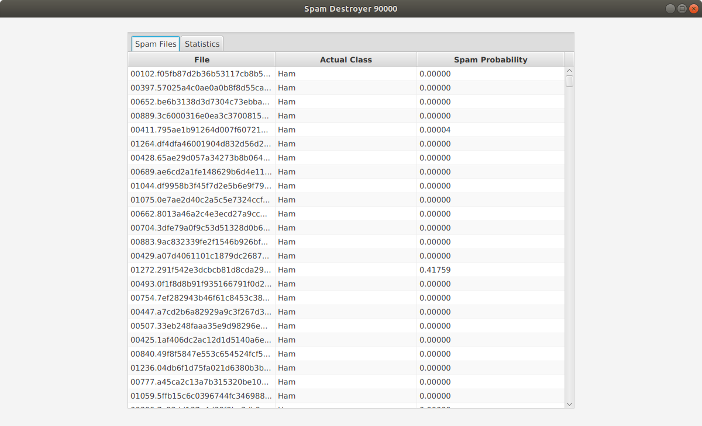
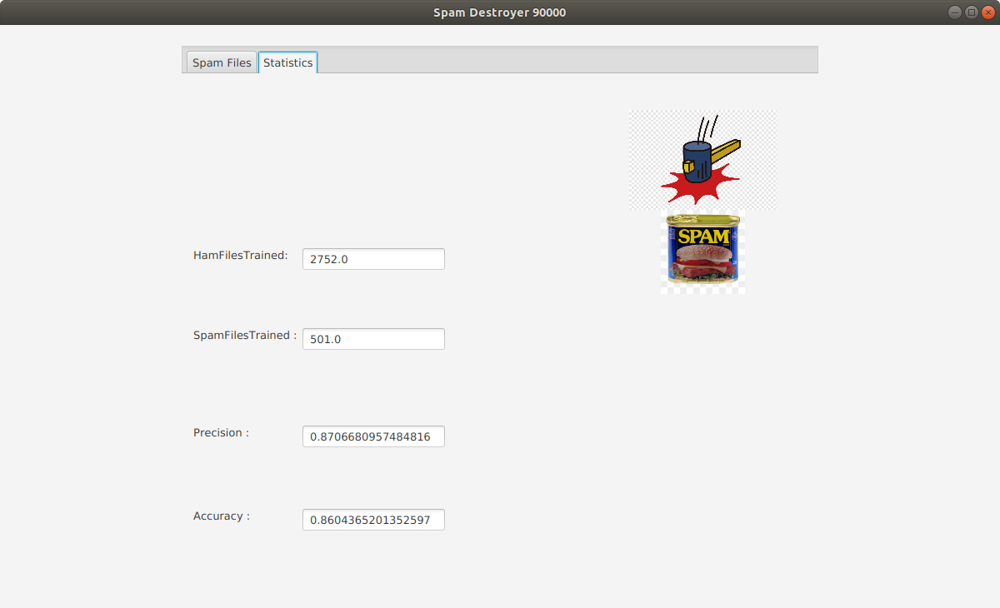

Project Information:
    This project utilizes TreeMaps in java to detect if an email is spam or not. The program reads files from a selected directory and analyzes each word in each file as part of the training phase. The program maps each unique word, paired with how many files contain that word into two maps, one for ham files and one for spam files. With these maps the program uses probability laws to calculate the probability if a file is spam, or ham, given a word, for each word. From this calculation, the probability of the file being spam given the file is calculated, done so by logarithmic and exponential equations to  normalize the data. The process is tested with test
data, which is read through, and spam probability is calculated. Output is a table containing all the files tested, as well as the true class and the spam probability. Accuracy and precision of the calculations were included as well.
 
Tab 1

Tab 2

 
Improvements:
    Improvements were made to this process by creating a list of words to be blacklisted from the calculations. Several of the top 10 most common english words were blacklisted, as well as some words that are extremely common in the email domain (ie. ‘sent’, ‘received’).
	A safety was implemented in the ProbabilityCounter class to prevent illegal math errors in the equations caused by ln(0) ir ln(1-1). This was prevented by altering the values to be very close to 1 or 0, but not exactly 1 or 0. Doing so caused an increase in accuracy and precision.
	The model was modified to reject words that only occurred in a single file from the probability calculation, to remove obscure words or words that act as outliers in a spam case. Doing so increased the accuracy.

How-to-Run:
    Clone from https://github.com/Jake-Andrews/csci2020u_jake-andrews.git, and navigate to the csci2020uAssignment1 folder. 
    Open the project in IntelliJ and navigate to Main.java, from here press run and the program will ask you to select a directory.
    Select 'Data' from csci2020uAssignment1/src, then the program will run and output a small window
 Important: This program is run on JDK 12.0.1 and javafx 15.0.1

References/Resources/Links:    
https://www.espressoenglish.net/the-100-most-common-words-in-english/
